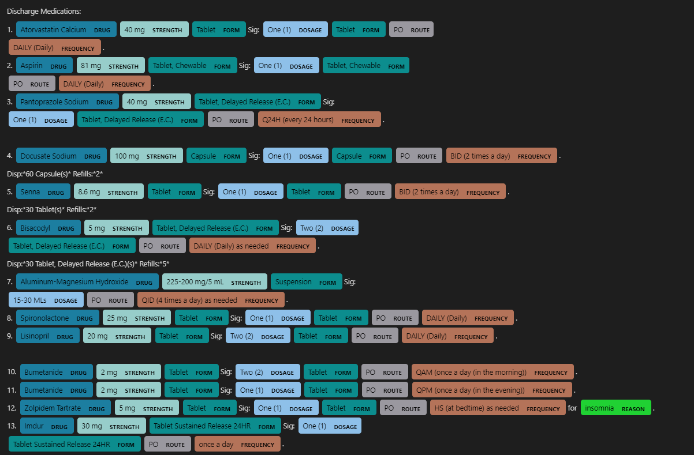

# Medical Named Entity Recognition with spaCy

This project demonstrates how to build a custom Named Entity Recognition (NER) model using the [spaCy](https://spacy.io/) library, specifically tailored for medical text data. The model is trained to identify medical entities such as diseases, medications, and procedures from unstructured text.

## Project Structure

```
NER_SpaCy/
├── NER_SpaCy.ipynb               # Jupyter Notebook for training and evaluation
├── config.cfg                    # spaCy training configuration file
├── base_config.cfg               # Base configuration template
├── train.spacy                   # Serialized training dataset
├── dev.spacy                     # Serialized development dataset
├── train_txt_ann.json            # Training data in JSON format
├── test_txt_ann.json             # Test data in JSON format
├── train.zip                     # Compressed training data
├── test.zip                      # Compressed test data
├── All_Scores_details_303f.txt   # Detailed scoring metrics
├── Score_details_303f.txt        # Summary of scoring metrics
├── CMD_Output_303f.txt           # Command-line output logs
├── Entity_details_303f.txt       # Extracted entity details
├── image/                        # Directory containing result images
└── README.md                     # Project documentation
```

## Getting Started

### Prerequisites

- Python 3.6 or higher
- [spaCy](https://spacy.io/)
- Jupyter Notebook

### Installation

1. **Clone the repository:**

   ```bash
   git clone https://github.com/Anudeep5/NER_SpaCy.git
   cd NER_SpaCy
   ```

2. **(Optional) Create a virtual environment:**

   ```bash
   python -m venv venv
   source venv/bin/activate  # On Windows: venv\Scripts\activate
   ```

3. **Install required packages:**

   ```bash
   pip install -r requirements.txt
   ```

   _If `requirements.txt` is missing:_

   ```bash
   pip install spacy
   ```

4. **Download a spaCy base model if needed:**

   ```bash
   python -m spacy download en_core_web_sm
   ```

## Usage

1. **Prepare the data:**

   Make sure your training and dev datasets are in `.spacy` format. Convert JSON or other formats using spaCy's `convert` utility if required.

2. **Configure the training:**

   Update `config.cfg` with your dataset paths and training parameters.

3. **Train the model:**

   ```bash
   python -m spacy train config.cfg --output ./output --paths.train ./train.spacy --paths.dev ./dev.spacy
   ```

4. **Evaluate the model:**

   Use the provided notebook `NER_SpaCy.ipynb` or review the output files:

   - `All_Scores_details_303f.txt`
   - `Score_details_303f.txt`
   - `CMD_Output_303f.txt`
   - `Entity_details_303f.txt`

## Results

Performance metrics such as precision, recall, and F1 score are available in `All_Scores_details_303f.txt` and `Score_details_303f.txt`.

## Example Output



## References

- [spaCy Documentation](https://spacy.io/usage)
- [Training spaCy's Named Entity Recognizer](https://spacy.io/usage/training#ner)

## License

This project is licensed under the MIT License. See the [LICENSE](LICENSE) file for details.
